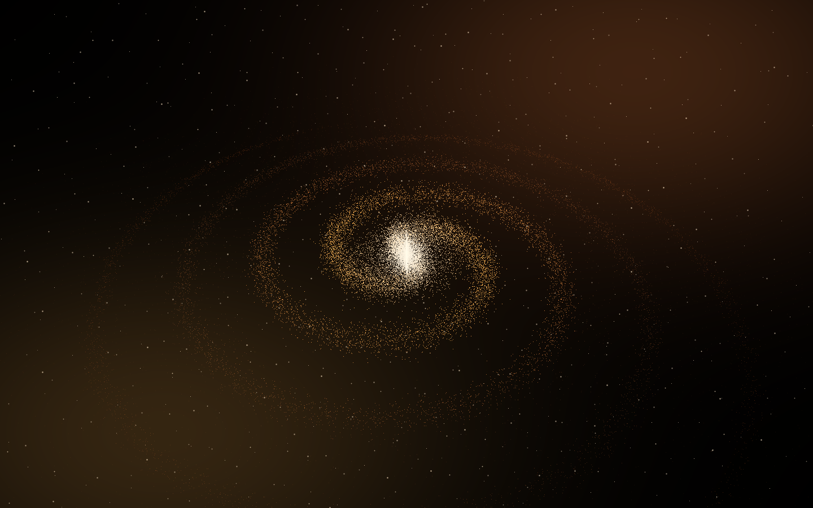

<div align="right">

# NEURAI — وب‌سایت شرکت هوش مصنوعی

وب‌سایتی پویا، فارسی و کاملاً راست‌به‌چپ، با دستیار هوشمند متن‌باز که **تماماً روی زیرساخت
خودتان** اجرا می‌شود. هیچ سرویس ابری خارجی، هیچ کلید API، و هیچ وابستگی‌ای که تحریم بتواند
قطع کند.

</div>

---

> **هویت برند** در [`src/config/brand.ts`](src/config/brand.ts) متمرکز است — نام، شعار و
> اطلاعات تماس فقط از همین یک فایل خوانده می‌شود و هیچ جای دیگری hardcode نشده است.
> اطلاعات تماس هنوز placeholder است و باید پیش از انتشار پر شود.

## Overview

A production-grade, Persian-first, RTL company website for an AI-native business.
Every moving part is open source and self-hosted, so the whole product comes up
with one `docker compose up` on hardware you control — and keeps running with no
outbound internet dependency.

| | |
|---|---|
| **Framework** | Next.js 16.2 · React 19.2 · TypeScript (strict) |
| **Styling** | Tailwind CSS v4 (CSS-first, logical properties throughout) |
| **CMS** | Payload 3.87 — runs *inside* the Next app, Persian admin, RTL out of the box |
| **Database** | Postgres 17 + pgvector + pg_trgm |
| **LLM** | Qwen3-14B on vLLM (Apache 2.0) — swappable via one env var |
| **Embeddings** | [MCINext/Hakim](https://huggingface.co/MCINext/Hakim) — Persian-specific, tops the FaMTEB benchmark |
| **Storage** | MinIO (S3-compatible) |
| **Edge** | Caddy (automatic TLS) |

## What makes it different

### A persistent, interactive cosmos

The background is a single WebGL2 scene mounted **once** in the root layout,
outside the page slot. Navigating never rebuilds the context: routes retarget
the camera, so moving through the site is one continuous shot rather than a
sequence of page loads.

Scroll is a **flight path**, not a zoom. The camera starts high above the disc
where the spiral is legible as a shape, descends through the arms, and ends
inside the core — driven by a single `--journey` variable that the CSS blooms
and the GPU scene both read, so they can never drift apart.

Particles are stored in polar form and the shader rebuilds their positions each
frame. That is what allows **differential rotation**: angular velocity falls
with radius, so the arms trail and wind the way a real disc does. Baking
Cartesian positions would force rigid rotation, which reads as a spinning
picture of a galaxy rather than a galaxy.

### The core is the assistant

There is no chat button anywhere on the site. The bright centre of the galaxy
**is** the assistant — point at it and it brightens, click it and the
conversation opens in the middle of the page.



A visually-hidden button exposes the same action to keyboard and screen-reader
users, becoming visible on focus. A light source with no control is beautiful
and completely unreachable otherwise.

That image is generated from the real geometry by
[`scripts/preview-cosmos.ts`](scripts/preview-cosmos.ts), which also emits the
static fallback served to visitors without WebGL2 — so the fallback can never
drift from the live scene.

### Design system — warm light on deep space

Colour is budgeted **60 : 30 : 10** — 60% unlit void, 30% structure, 10% signal.

Everything is warm. There is no cool pole anywhere in the palette, so the warmth
reads as a decision rather than a default; a single blue element would look like
a bug. The void tones carry a red-brown cast rather than being neutral black,
because neutral black under warm light reads as a printing error.

| Share | Role | Tokens |
|---|---|---|
| 60% | Void | `#050303` · `#0a0706` · `#120d09` |
| 30% | Structure | cream `#f4ead9` · muted `#a89179` · warm-tinted glass |
| 10% | Signal | core `#fff4de` · gold `#ffb454` · copper `#e07b3c` · ember `#9c4a18` |

Type: **Estedad** display · **Vazirmatn** body · **Space Grotesk** Latin and
wordmark. All self-hosted from `@fontsource-variable`, no CDN.

### RTL is structural, not a patch

`dir="rtl"`, logical properties only (`ms-`, `pe-`, `start-`), Persian digits and
Jalali dates via native `Intl` (zero date dependencies), and Persian slugs kept
in URLs rather than transliterated.

## Quick start

```bash
cp .env.example .env
```

Fill in `.env`, then generate a secret:

```bash
node -e "console.log(require('crypto').randomBytes(32).toString('hex'))"
```

Start the infrastructure (Postgres, MinIO — no GPU needed):

```bash
docker compose up -d db storage storage-init
```

Install and run:

```bash
pnpm install && pnpm dev
```

Open <http://localhost:3000> for the site and <http://localhost:3000/admin> to
create the first admin user.

### With the AI services

Requires an NVIDIA GPU with 24GB+ VRAM and the container toolkit:

```bash
docker compose --profile ai up -d
```

First start downloads model weights into `./models` (gitignored) and takes a
while. The site works fine without this — the assistant reports itself
unavailable rather than erroring, and every other feature is unaffected.

### Applying the non-Payload schema

`docker/initdb/*.sql` runs automatically only on a *fresh* Postgres volume. For
an existing database:

```bash
pnpm db:setup
```

## Scripts

| Command | Purpose |
|---|---|
| `pnpm dev` | Development server |
| `pnpm build` / `pnpm start` | Production build and serve |
| `pnpm typecheck` | `tsc --noEmit` |
| `pnpm lint` | ESLint, including the RTL logical-property rule |
| `pnpm db:setup` | Apply extensions + app tables to an existing database |
| `pnpm cosmos:preview` | Re-render the galaxy preview and static fallback |
| `pnpm migrate:create` | Generate a Payload migration |

## Architecture

```
Caddy (TLS) ──▶ Next.js 16 ──┬──▶ Postgres 17 + pgvector
                             ├──▶ vLLM        (OpenAI-compatible :8000)
                             ├──▶ Hakim       (embeddings :8080)
                             └──▶ MinIO       (S3 :9000)
```

**[`docs/DIAGRAMS.md`](docs/DIAGRAMS.md)** — ten Mermaid diagrams covering the
deployment topology, data model, publish→index pipeline, chat request sequence,
where privacy consent is enforced, the cosmos flight path, the core→assistant
interaction, and the degradation ladder. They render inline on GitHub.

Full written detail, including the data model and the RAG pipeline, in
[`docs/ARCHITECTURE.md`](docs/ARCHITECTURE.md).

### Swapping the model

The app only ever talks to an OpenAI-compatible endpoint, so the model is a
deployment decision:

```bash
AI_BASE_URL=http://llm:8000/v1
AI_MODEL=Qwen/Qwen3-14B-AWQ
```

Point these anywhere — llama.cpp, Ollama, or a hosted provider — with no code
change.

## Privacy

Personalization and assistant memory are **opt-in**. Until a member consents,
no behavioural events are recorded and no memories are stored or injected into
chat context; consent is enforced server-side, not left to the client. `DNT: 1`
is honoured. Members can delete individual memories or their whole account.

## Licence

Source is MIT. Note that fonts (Vazirmatn, Estedad, Space Grotesk — SIL OFL) and
models (Qwen3 Apache-2.0, Hakim) carry their own licences.
