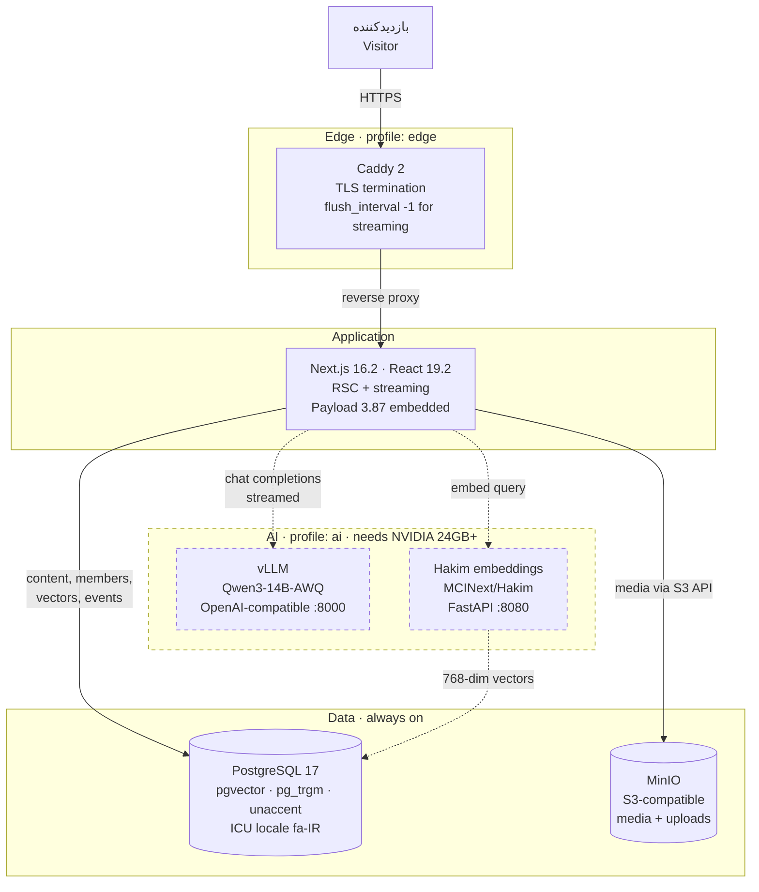
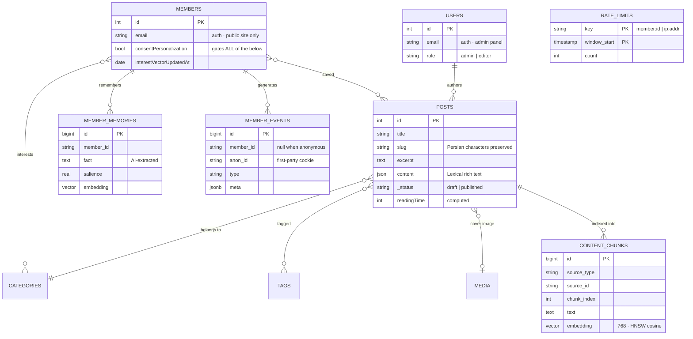
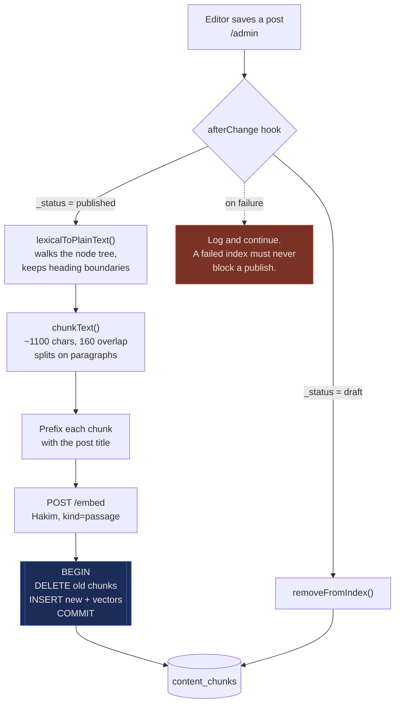
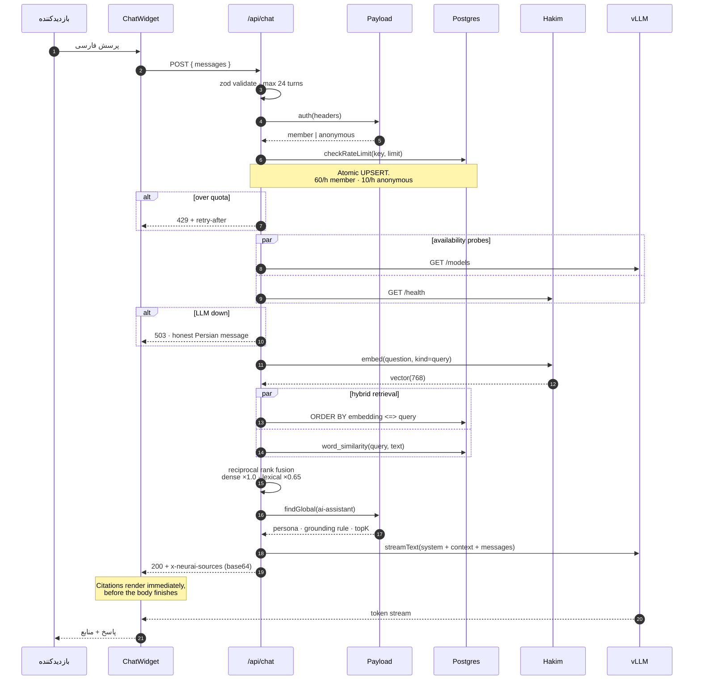
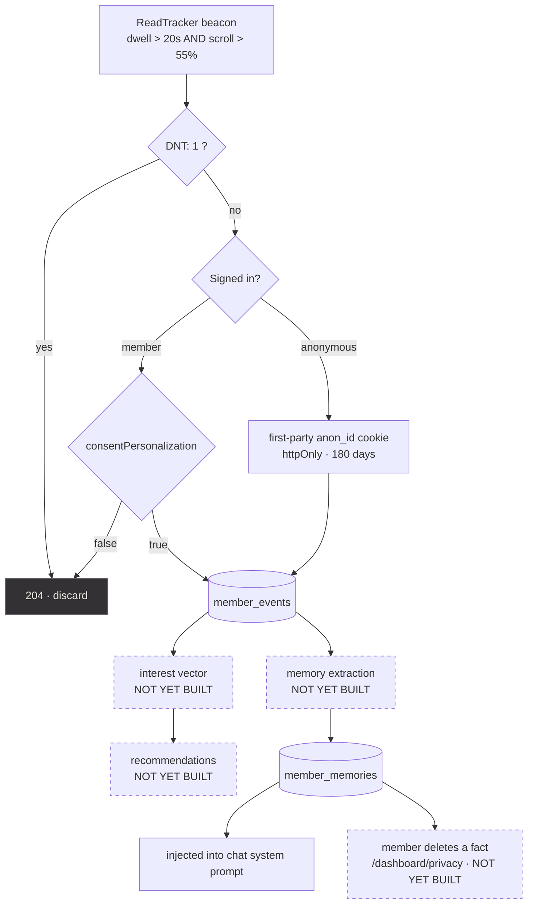
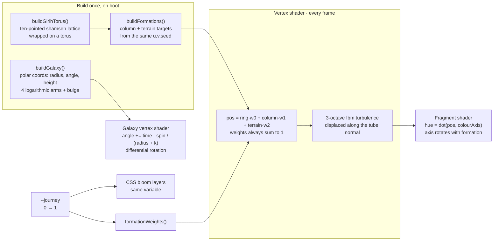
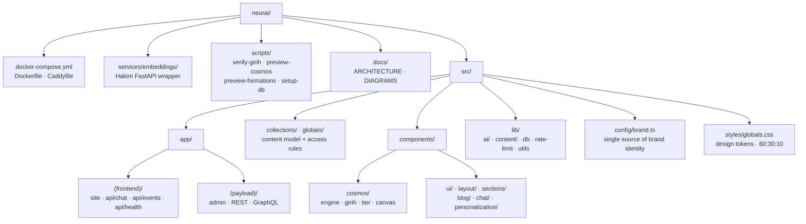

# نمودارهای معماری — NEURAI

# Architecture diagrams

Every diagram here describes what is actually in the repository, not an
intended future state. Where something is not yet built it is marked as such.

Diagrams are Mermaid, so they render directly on GitHub.

---

## 1. Deployment topology

The whole product is containers you own. Nothing here depends on a service that
sanctions could sever, which is the constraint the entire stack was chosen
around.

**Why the `ai` profile is opt-in.** A laptop with no GPU runs the entire site —
CMS, blog, accounts, admin — with `docker compose up -d`. Only the assistant
needs the GPU, and it degrades to an honest "unavailable" message rather than
erroring. `/api/health` reports the AI services but never fails on them, so a
down GPU box can't pull the site out of a load balancer.

---

## 2. Data model

Two distinct halves, deliberately separated.

**Payload owns** `users`, `members`, `posts`, `categories`, `tags`, `media`, and
the two globals. Its schema is generated from collection configs.

**Raw SQL owns** `content_chunks`, `member_memories`, `member_events`, and
`rate_limits`. These stay out of the CMS on purpose: pgvector columns, HNSW
indexes and high-write event tables would clutter the admin UI and fight
Payload's migration generator. They live in `docker/initdb/02-app-tables.sql`
and are applied by `pnpm db:setup`.

---

## 3. Publish → retrieval index

Indexing hangs off the publish lifecycle, so the index is a pure function of
what is currently published. No cron job to drift out of sync, no manual
reindex step for an editor to forget.

Two decisions worth knowing:

- **Delete-then-insert in a transaction**, not a diff. Edits reshuffle chunk
  boundaries, so matching old chunks to new is more work than rebuilding — and
  the transaction means retrieval never sees a half-indexed document.
- **Every chunk is prefixed with the post title.** A mid-article chunk that
  never repeats the subject noun is otherwise invisible to search.

---

## 4. The chat request

**Why citations travel in a header.** The client can render source links the
moment the stream opens rather than waiting for the body. Base64 because HTTP
headers are not safe for raw Persian UTF-8.

**Why hybrid retrieval.** Neither arm is sufficient for Persian. Vectors miss
exact tokens — product names, version numbers, Latin acronyms inside Persian
text. Lexical misses paraphrase, and Postgres ships no Persian stemmer, so
"سامانه" and "سامانه‌ها" don't match. RRF fuses them because cosine distance
and trigram similarity aren't on comparable scales, and rank is robust to that.

---

## 5. Privacy: where consent is enforced

Consent is checked **server-side**, not left to the client to honour. A member
who has not opted in is silently ignored and still receives `204`, so the
response can't be used to probe consent state.

Dashed nodes are **not implemented yet**. The capture side and the schema exist;
the consumption side does not.

---

## 6. The cosmos: one scene, three formations

The background is a single WebGL2 scene mounted **once** in the root layout,
outside the page slot. Navigation retargets the camera instead of rebuilding the
context, which is what makes moving through the site read as one continuous shot
rather than a sequence of page loads.

Five layers, drawn back to front: nebula → galaxy → star shells → girih ring.

Formation handover across the scroll, from `FORMATION_SCHEDULE` in
`src/components/cosmos/engine.ts`:

```mermaid
stateDiagram-v2
    direction LR

    [*] --> Ring

    Ring: Ring · حلقه
    Ring: scroll 0 – 26%
    Ring: girih torus, spinning, full turbulence

    RingToColumn: cross-fade
    RingToColumn: 26 – 42%
    RingToColumn: smoothstep, rotation winds down

    Column: Column · ستون
    Column: 42 – 60%
    Column: vertical plume, turbulence ×0.55

    ColumnToTerrain: cross-fade
    ColumnToTerrain: 60 – 78%
    ColumnToTerrain: camera lifts and pitches down

    Terrain: Terrain · چشم‌انداز
    Terrain: 78 – 100%
    Terrain: wave landscape, no rotation, turbulence ×0.3

    Ring --> RingToColumn
    RingToColumn --> Column
    Column --> ColumnToTerrain
    ColumnToTerrain --> Terrain
    Terrain --> [*]
```

| Scroll | ring | column | terrain | Colour axis |
|---|---|---|---|---|
| 0 – 26% | 1.00 | 0.00 | 0.00 | diagonal `(0.42, 1)` |
| 42 – 60% | 0.00 | 1.00 | 0.00 | vertical `(0.15, 1)` |
| 78 – 100% | 0.00 | 0.00 | 1.00 | horizontal `(1, 0.12)` |

The plateaus matter as much as the transitions. A formation needs a stretch
where it is simply itself and the reader can look at it — without them the page
reads as one continuous unresolved morph.

**Why one particle buffer instead of three systems.** Each point's destination
in every formation derives from the same `(ringAngle, tubeAngle, seed)` triple,
so neighbours stay neighbours through the morph — the ring visibly unravels into
the column. Cross-fading three independent systems would read as one thing
vanishing while another appears.

**Why the weights must sum to 1.** They are interpolation coefficients. If they
are allowed to under-sum, every point drifts toward the origin mid-transition
and the whole field collapses inward.

---

## 7. Graceful degradation

Each layer fails to a still-usable state rather than to an error. This matters
more than usual here: the target host is inside Iran, on hardware that may not
have a GPU on day one.

```mermaid
flowchart TB
    subgraph cosmos["Cosmos background"]
        c1["WebGL2 + high tier<br/>40k points, bloom"]
        c2["medium / low tier<br/>fewer points, no bloom"]
        c3["prefers-reduced-motion<br/>one static frame"]
        c4["no WebGL2 or Save-Data<br/>pre-rendered WebP + CSS starfield"]
        c1 --> c2 --> c3 --> c4
    end

    subgraph assistant["AI assistant"]
        a1["vLLM + Hakim up<br/>grounded answers with citations"]
        a2["embeddings down<br/>persona only, no invented facts"]
        a3["LLM down<br/>503 + honest Persian message"]
        a1 --> a2 --> a3
    end

    subgraph site["Site"]
        s1["Postgres up<br/>everything works"]
        s2["Postgres down<br/>503 · this is the one hard dependency"]
        s1 --> s2
    end
```

The static fallback image is generated **from the real geometry** by
`scripts/preview-cosmos.ts`, so it can never drift from the live scene the way a
hand-taken screenshot would.

---

## 8. Repository shape

Two route groups, two root layouts. The admin panel never loads the cosmos
canvas or the site fonts, and the site never loads Payload's admin CSS.
